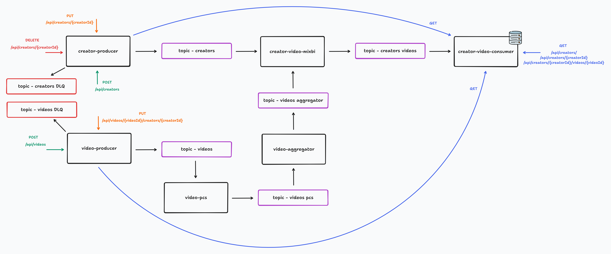
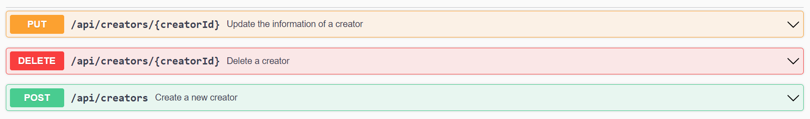
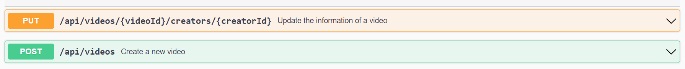
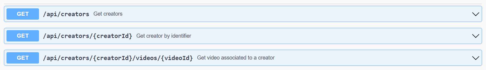

# Yelteberus: Kafka Project

## Microservices

### Creator-producer
- Responsible for managing the creation, updating and deletion of creators
  - **Key:** creator_identifier
  - **Value:** creator_identifier, name, surname, birth, email, phone
### Video-producer
- Responsible for managing the creation and updating of videos
  - **Key:** video_identifier, creator_identifier
  - **Value:** video_identifier, title, duration, upload_date, format, categories, description
### Video-pcs
- Responsible for adding new information (views, resolution and privacy) to the videos
  - **Key:** video_identifier, creator_identifier
  - **Value:** video_identifier, title, duration, upload_date, format, categories, description, views, resolution, privacy
### Video-aggregator
- Responsible for grouping the videos using the creator identifier
  - **Key:** creator_identifier
  - **Value:** List[video_identifier, title, duration, upload_date, format, categories, description, views, resolution, privacy]
### Creator-video-mixbi
- Responsible for grouping video information with creator information
  - **Key:** creator_identifier
  - **Value:** creator_identifier, name, surname, List[video_identifier, title, duration, upload_date, format, categories, description, views, resolution, privacy]
### Creator-video-consumer
- Responsible for querying user and video information
  - **Key:** creator_identifier
  - **Value:** creator_identifier, name, surname, List[video_identifier, title, duration, upload_date, format, categories, description, views, resolution, privacy]

## Installation
1. ``maven clean install`` to install the project dependencies
2. ``docker-compose up --build`` to build up Prometheus, Grafana, ELK & PostgreSQL
3. Run the Sonarqube container: ``docker run -d --name sonarqube -e SONAR_ES_BOOTSTRAP_CHECKS_DISABLE=true -p 9000:9000 sonarqube:latest``
4. Start the microservices from the IDE

**You can also run the tests of the different microservices**

## Documentation

### Prometheus
- Open-source monitoring solution for collecting and aggregating metrics as time series data
- Each item in a Prometheus store is a metric event accompanied by the timestamp it occurred
- [Prometheus URL](http://localhost:9090/)

### Grafana
- Tool for visualizing and analyzing data from various sources
- Lets you keep tabs on application performance and error rates
- [Grafana URL](http://localhost:3000/)

### Filebeat
- Lightweight shipper for forwarding and centralizing log data
- Can send data directly to Elasticsearch or via Logstash

### Logstash
- Tool that can extract, transform, and load the data using filters and plugins
- It collects data from different sources and send to multiple destinations

### Elasticsearch
- An open-source search and analytics engine
- Proficient in managing colossal volumes of data, delivering the precise information we seek

### Kibana
- An open-source data visualization dashboard for Elasticsearch
- It provides visualization capabilities on top of the content indexed on an Elasticsearch cluster
- [Kibana URL](http://localhost:5601/)

### Sonarqube
- Code quality analysis tool for Maven based Java projects
- It covers a wide area of code quality check points
- [Sonarqube URL](http://localhost:9000/)

## APIs

### Creator-producer API
- Produce a new creator
- Update a creator
- Delete a creator
- [Swagger Creator-producer](http://localhost:8082/swagger-ui/index.html)

### Video-producer API
- Produce a new video
- Update a video
- [Swagger Video-producer](http://localhost:8083/swagger-ui/index.html)

### Creator-video-consumer API
- Get creators (and videos)
- Get creator (and his/her videos)
- Get video associated to a creator
- [Swagger Creator-video-consumer](http://localhost:8087/swagger-ui/index.html)

